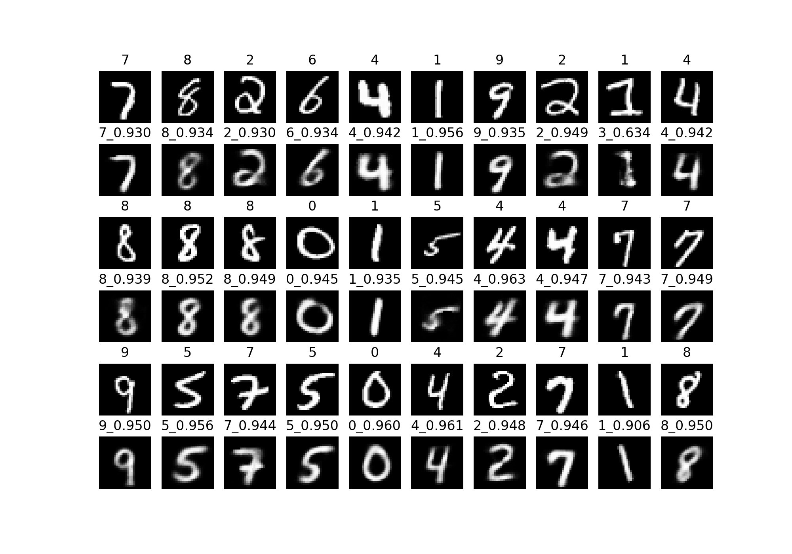
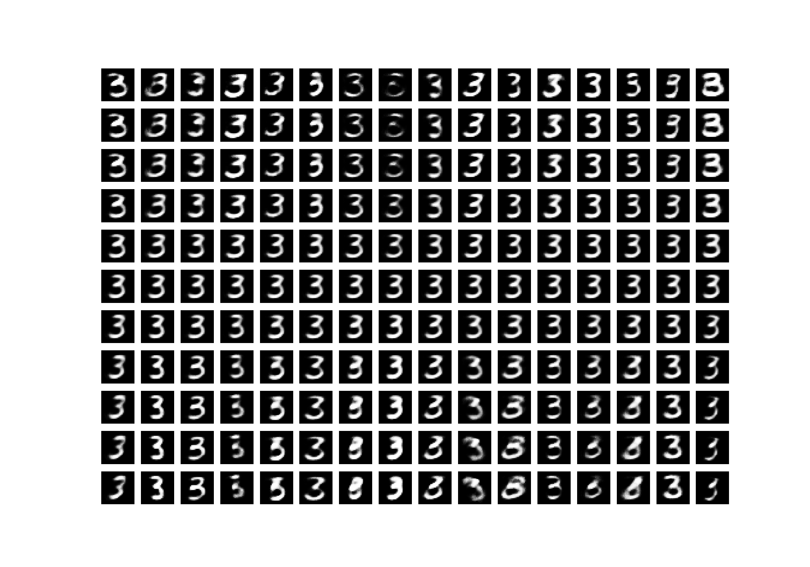
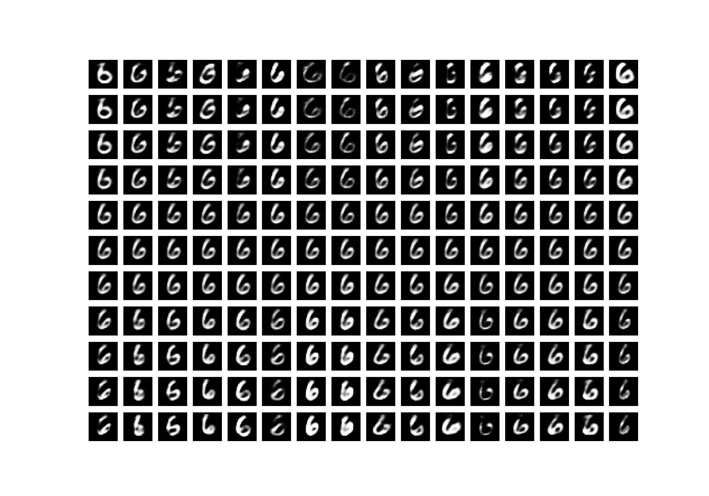
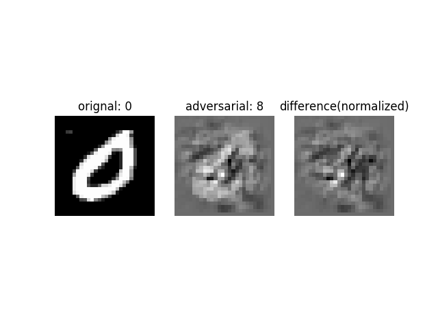
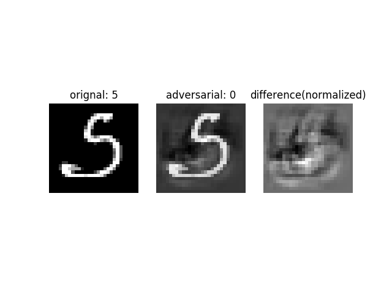

# Dynamic Routing Between Capsules
reference: [Dynamic routing between capsules](https://arxiv.org/abs/1710.09829v1) by **Sara Sabour, Nicholas Frosst, Geoffrey E Hinton**

Note: this implementation strictly follow the instructions of the paper, check the paper for details.

## Takeaways

**The key of the paper is not how accurate the `CapsNet` is, but the `novel idea of 
representation of image with capsule`**.


## Dependencies

* Codes are tested on `tensorflow 1.3`, and `python 2.7`. But it should be compatible with `python 3.x`
* Other dependencies as follows, 

```
six>=1.11
matplotlib>=2.0.2
numpy>=1.7.1
scipy>=0.13.2
easydict>=1.6
tqdm>=4.17.1
```
install by running 

```bash
$ cd $ROOT
$ pip install -r requirements.txt
``` 

## Experiments

**NOTE: all the experiments conducted on the checkpoint: [Jbox(SJTU)](https://jbox.sjtu.edu.cn/l/SHwJ5d) or
[Google_Drive](https://drive.google.com/file/d/0B42lXNgnb27XZ0JKRjdiVldyRzQ/view?usp=sharing)**

### reconstruction 

By running:
```bash
$ cd code
$ python eval.py --ckpt 'path/to/ckpt' --mode reconstruct
```
**reconstruct results:**
(Note: the float numbers on the row with even number are max norm of the 10 digit capsules)




### capsule unit representation

By running:
```bash
$ cd code
$ python eval.py --ckpt 'path/to/ckpt' --mode cap_tweak
```
**results:**  

Note: images along `x-axis` are representations of units of 16-D vector, and `y-axis` corresponds 
to the tweak range of [-0.25, 0.25] with stride 0.05.




### adversarial test
By running:
```bash
$ cd code
$ python eval.py --ckpt 'path/to/ckpt' --mode adversarial
```

**result:**





**the adversarial result is not as good as i expected, I was hoping that `capsule` representation 
would be more robust to adversarial attack.**

### training 

Note: all trained with `batch_size = 100`

latest commit with `3 iterations of dynamic routing`:
    
    1. update dynamic routing with tf.while_loop and static way
    2. fix margin loss issue
    
**result:**

Iterations | 1k     | 2k    | 3k    | 4k    | 5k    
:---------:|:------:|:-----:|:-----:|:-----:|:-----:
  val_acc  | 98.90  | 99.16 | 99.09 | 99.30 | 99.24
  test_acc |   -    |   -   | -     |   -   |  99.21 

commit [8e3785d](https://github.com/InnerPeace-Wu/CapsNet-tensorflow/tree/8e3785d5b6f34c13c81555edd97a6241a7885209). 

    with bugs:
    1. wrong implementation of margin loss
    2. updating `prior` during routing 
    
**result:**

Iterations | 2k     | 4k    | 5k    | 7k    | 9k    | 10k   
:---------:|:------:|:-----:|:-----:|:-----:|:-----:|:-----:
  val_acc  | 98.02  | 98.58 |  -    | 98.82 | 98.96 | -
  test_acc |   -    |   -   | 98.89 |   -   |   -   | 99.09 
  

## Train

* clone the repo, and set up parameters in `code/config.py`
* then 

```bash
$ cd $ROOT/code
$ python train.py --data_dir 'path/to/data' --max_iters 10000 --ckpt 'OPTIONAL:path/to/ckpt' --batch_size 100
```
or train with logs by runing(NOTE: set extra arguments in train.sh accordingly):

```bash
$ cd $ROOT/code
$ bash train.sh
```

* ~~The less accurate may due to the missing `3M` parameters.(My implementaion with 8M 
compared to 11M referred in the paper.)~~ Different input size.
* The model is still under-fitting.

## TODO
- [x] report exclusive experiment results
- [ ] try to fix the inefficacy

## Reference

* [Keras implementation](https://github.com/XifengGuo/CapsNet-Keras)
* Discussion about **routing algorithm**, [issue](https://github.com/naturomics/CapsNet-Tensorflow/issues/8) and [issue](https://github.com/XifengGuo/CapsNet-Keras/issues/1)
